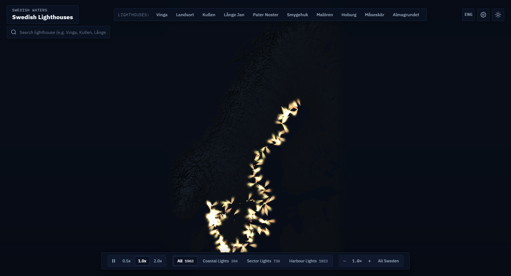

# Svenska Fyrar · Swedish Lighthouse Map

An interactive, real-time WebGPU visualization of Sweden's coastal and navigational lighthouses, sweeping light beams, and nautical sectors.

<p align="center">
  
</p>

## System Architecture

```
                       DATA INGESTION PIPELINE
                     
 ┌──────────────────────┐        ┌─────────────────────────┐
 │ OpenStreetMap (OSM)  │        │ Copernicus GLO-30 DEM   │
 │ Overpass API Seamarks│        │ Global Elevation Tiles  │
 └──────────┬───────────┘        └────────────┬────────────┘
            │                                 │
            ▼                                 ▼
 ┌──────────────────────┐        ┌─────────────────────────┐
 │ extract_lighthouses  │        │ build_plate.py          │
 │ parse_iala.js        │        │ - High-res hillshading  │
 │ - Parse IALA rhythms │        │ - Coastline mask blend  │
 │ - Extract arc angles │        │ - Packed 4096x6144 plate│
 └──────────┬───────────┘        └────────────┬────────────┘
            │                                 │
            ▼                                 │
 ┌──────────────────────┐                     │
 │ generate_manifest.js │                     │
 │ - Spatial validation │                     │
 │ - Pack sector buffers│                     │
 └──────────┬───────────┘                     │
            │                                 │
            ▼                                 ▼
       manifest.json                      plate.png
   (1,963 parsed beacons)            (35.3 MB relief texture)
            │                                 │
            └────────────────┬────────────────┘
                             │
                             ▼
                    CLIENT APPLICATION
                     
                     index.html
             ┌───────────────────────────────┐
             │ WebGPU Render Loop (60 FPS)   │
             │ ├─ Instanced Quad SDF Beams   │
             │ ├─ Bilinear DEM Terrain Shading│
             │ ├─ Atmospheric Fog Scattering │
             │ ├─ Nautical Compass Rose      │
             │ ├─ Solo Beam Isolation Mode   │
             │ ├─ Real-Time Light Studio     │
             │ ├─ Spatial Hash Hit-Testing   │
             │ └─ Bilingual UI (ENG / SWE)   │
             └───────────────────────────────┘
```

---

## Maritime Dataset Coverage

The map covers the Swedish coastline, archipelago fairways, and major inland waters (Lake Vänern, Lake Vättern, and Lake Mälaren), spanning from **55.3°N to 66.0°N**:

- **Total Navigational Aids**: 1,963 mapped and validated lights.
- **Sector Fairway Lights**: 736 lights with colored red, green, and white navigational arcs.
- **Major Coastal Beacons**: 204 high-power coastal lights with revolving beams.
- **Harbour & Leading Lights**: 1,023 channel markers and harbour entrance lights.

---

## Key Features

- **Hardware-Accelerated WebGPU Rendering**: Instanced quad rendering with analytical Signed Distance Fields (SDF) and physical atmospheric fog glow.
- **High-Resolution Elevation Relief**: Custom 4096×6144 digital elevation plate derived from Copernicus DEM (Digital Elevation Model) with ocean water masking.
- **Authentic IALA Light Rhythms**: Real-time rotating sweeps and flashing rhythms parsed from IALA (International Association of Marine Aids to Navigation and Lighthouse Authorities) notations (e.g. `Fl(2) WRG 6s`, `Iso W 4s`, `LFl 10s`).
- **Interactive Compass Sector Rose**: Dynamic vector compass diagram displaying exact red, green, and white navigation arcs aligned to true cardinal headings.
- **Solo Beam Isolation**: Isolate individual navigational corridors (`Isolate beam`) to analyze fairway approaches free from surrounding light clutter.
- **Real-Time Light Studio**: Floating settings dock to customize incandescent tungsten warmth, radiant beam reach, light intensity, and terrain ambient exposure.
- **Bilingual Interface**: Instant English and Swedish localization with persistent state storage, preserving original Swedish lighthouse names.
- **High-Speed Spatial Hit-Testing**: Grid-based CPU spatial hash enabling sub-millisecond beacon selection on click and hover without GPU readback latency.

---

## Lighthouse Categories

| Category | Typical Character | Description & Included Lights |
| :--- | :--- | :--- |
| **Coastal Lights** *(Kustfyrar)* | Revolving white beam (`Fl`, `LFl`) | High-power landfall and coastal lights visible at long range (Vinga, Långe Jan, Kullen, Pater Noster, Hoburg, Måseskär). |
| **Sector Lights** *(Ledfyrar)* | Multi-color arcs (`WRG`) | Channel navigation lights that divide the sea into safe white fairways flanked by red and green warning sectors. |
| **Leading Lights** *(Ensfyrar)* | Fixed or synchronized (`Iso`, `Oc`) | Paired alignment lights (upper and lower) guiding vessels through narrow dredged channels. |
| **Harbour Lights** *(Hamnfyrar)* | Port/Starboard markers (`Q`, `Fl R/G`) | Breakwater and pierhead lights marking harbour entrances and marina approaches. |
| **Caisson Lights** *(Kassunfyrar)* | Massive open-sea towers (`LFl`, `Fl(3)`) | Heavy reinforced concrete caissons anchored in open water on submerged shoals (Almagrundet, Revengegrundet, Sydostbrotten). |

---

## Project Structure

```
swe-lighthouse-map/
├── index.html                 # Application entry point and viewport layout
├── package.json               # Build scripts, Vitest runner, and devDependencies
├── tsconfig.json              # Strict TypeScript compiler options
├── vite.config.ts             # Vite development server and bundling setup
├── vercel.json                # Vercel deployment config with immutable asset caching
├── public/
│   ├── preview.png            # Showcase preview image
│   └── data/
│       ├── manifest.json      # Compiled beacon registry and sector geometries (2.4 MB)
│       └── plate.png          # 4096×6144 packed DEM relief and water plate (35.3 MB)
├── pipeline/
│   ├── extract_lighthouses.js # OSM Overpass API seamark extraction query
│   ├── parse_iala.js          # IALA light character parser and rhythm tokenizer
│   ├── build_plate.py         # Copernicus DEM rasterizer and relief packer
│   └── generate_manifest.js   # Final manifest compiler and sector validator
├── src/
│   ├── main.ts                # Application coordinator and initialization
│   ├── style.css              # Precision instrument dark/light design system
│   ├── fonts.css              # Centralized typography definition (IBM Plex)
│   ├── components/
│   │   ├── Header.ts          # Title, curated bookmarks, theme & language buttons
│   │   ├── Controls.ts        # Playback speed, pause toggle, tier filters, zoom
│   │   ├── Inspector.ts       # Detailed beacon inspection card and metrics
│   │   ├── LightSettings.ts   # Floating lighting studio and exposure adjustment modal
│   │   ├── Search.ts          # Instant fuzzy beacon search overlay
│   │   └── SectorRose.ts      # Interactive SVG compass sector diagram
│   ├── lib/
│   │   ├── webgpu-renderer.ts # WebGPU device manager, buffers, pipelines, textures
│   │   ├── map-camera.ts      # Web Mercator camera with inertial pan and zoom
│   │   ├── spatial-hash.ts    # CPU-side spatial index for instant beacon hit-testing
│   │   ├── lighthouse-probe.ts# Hover and click detection coordinator
│   │   ├── theme-manager.ts   # Dark and light mode theme switcher
│   │   ├── i18n.ts            # Bilingual dictionary and reactive language manager
│   │   └── types.ts           # Core TypeScript data schemas and nautical interfaces
│   └── shaders/
│       ├── beam_web.wgsl      # Instanced quad beam shader with terrain interaction
│       ├── beam_sector_sdf.wgsl # Hardware Signed Distance Field sector fan shader
│       ├── beam_common.wgsl   # Shared nautical math and coordinate projection structs
│       └── mipmap.wgsl        # WebGPU compute shader mipmap generator
└── tests/
    ├── iala-parser.test.ts    # Unit tests for IALA character parsing
    ├── shader-syntax.test.ts  # Validation tests for WGSL shader structures
    ├── spatial-hash.test.ts   # Hit-testing performance and radius tests
    ├── camera-projection.test.ts # Web Mercator coordinate projection tests
    ├── data-integrity.test.ts # Validation tests for manifest coordinates and sectors
    └── i18n.test.ts           # Parity and reactivity tests for English/Swedish strings
```

---

## Running Locally

### Prerequisites

- [Node.js](https://nodejs.org/) (v18.0.0 or higher recommended)
- A browser supporting WebGPU:
  - Google Chrome / Chromium 113+
  - Microsoft Edge 113+
  - Safari 18+ (macOS Sonoma / iOS 17+)
  - Firefox Nightly (with `dom.webgpu.enabled` set to `true`)

### Installation & Setup

1. Clone the repository:
   ```bash
   git clone git@github.com:joehu131/swe-lighthouse-map.git
   cd swe-lighthouse-map
   ```

2. Install dependencies:
   ```bash
   npm install
   ```

3. Start the Vite development server:
   ```bash
   npm run dev
   ```

4. Open `http://localhost:5173/` in your web browser.

---

## Running Automated Tests

Run the complete test suite with Vitest:

```bash
npm run test
```

This verifies:
- Parsing of compound IALA flash notations (e.g. `Fl(2) WRG 6s`, `Iso W 4s`).
- Coordinate conversion between WGS84 (EPSG:4326) and Web Mercator (EPSG:3850).
- Structure alignment and type safety across WGSL (WebGPU Shading Language) shaders.
- Spatial hash index query accuracy across all 1,963 beacons.
- Language dictionary parity and reactive event subscriptions.

---

## Building for Production

Compile TypeScript and build the optimized distribution bundle:

```bash
npm run build
```

The output bundle is generated in the `dist/` directory. You can preview the production build locally:

```bash
npm run preview
```

---

## Data Pipeline & Rebuilding

The project data can be refreshed or regenerated from source using the scripts in `pipeline/`:

```bash
npm run pipeline:all
```

This master pipeline executes three sequential stages:
1. **Extract Seamarks** (`pipeline/extract_lighthouses.js` & `pipeline/parse_iala.js`): Queries the OpenStreetMap Overpass API and normalizes maritime light tags.
2. **Build Terrain Plate** (`pipeline/build_plate.py`): Resamples Copernicus GLO-30 elevation data and coastline geometries into a 4096×6144 relief plate.
3. **Compile Manifest** (`pipeline/generate_manifest.js`): Validates beacon bounds and packs sector geometries into `public/data/manifest.json`.

---

## Deployment (Vercel)

The repository is configured for direct deployment on [Vercel](https://vercel.com/):

1. Import `swe-lighthouse-map` from GitHub into Vercel.
2. Vercel automatically detects the Vite framework settings:
   - **Framework**: Vite
   - **Build Command**: `npm run build`
   - **Output Directory**: `dist`
   - **Install Command**: `npm install`
3. Static data assets (`plate.png` and `manifest.json`) are automatically served with 1-year immutable caching headers via `vercel.json`.

---

## License

This project is licensed under the [MIT License](LICENSE).
